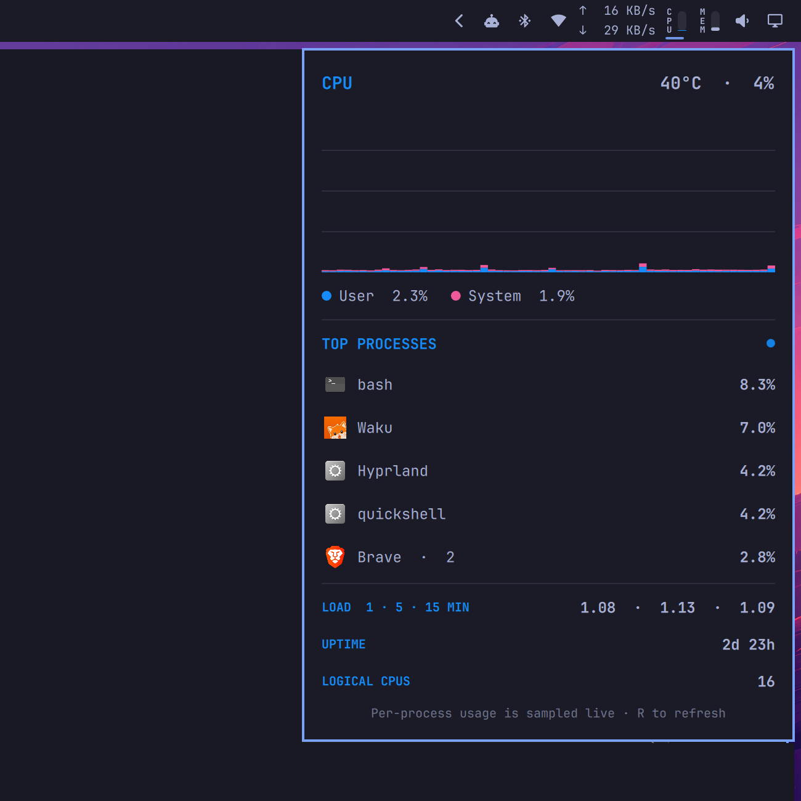

# CPU Usage for Omarchy

An iStat Menus-inspired Omarchy Quattro bar widget for live CPU usage, history, temperature, top processes, load averages, and uptime.



## Features

- Compact upright vertical `CPU` label and adjacent meter, centered in a standard icon slot
- Bottom-up stacked meter with blue user time and pink system time
- Sixty-second user/system history graph
- CPU temperature, load averages, uptime, and logical CPU count
- Top processes grouped by executable name, with application icons
- Theme-aware native panel with keyboard and adjacent-panel switching

## Install

```sh
omarchy plugin add https://github.com/egoist/omarchy-cpu-usage.git --enable
```

The widget lands in the right section of the bar. Move it if needed:

```sh
omarchy bar move dev.egoist.cpu-usage --section right
```

## Configure

Set the fixed horizontal widget width (default `27`, the standard icon slot):

```sh
omarchy bar set dev.egoist.cpu-usage width 27
```

Set the number of process rows (default `5`, range `1–10`):

```sh
omarchy bar set dev.egoist.cpu-usage processCount 5
```

## How the metrics work

Overall user and system usage are calculated from deltas in Linux's aggregate `/proc/stat` CPU counters. The bar keeps the latest 60 one-second samples for its panel graph.

Per-process usage is measured across a live 650 ms sample of each process's user and system CPU counters. Percentages use one logical CPU as 100%, so a multi-threaded process can exceed 100%.

Temperature prefers CPU-specific hwmon sensors such as `k10temp` and `coretemp`, with the first readable hwmon temperature as a fallback.

## Dependencies and security

The plugin runs unsandboxed with your user permissions, like every Omarchy shell plugin. It does not use `sudo`, install packages, start services, or access the network.

It reads Linux's `/proc` and `/sys/class/hwmon` statistics and uses commands included with a standard Omarchy installation: Bash, `awk`, `sort`, `head`, `getconf`, `date`, and `jq`.

## Update

```sh
omarchy plugin update dev.egoist.cpu-usage
```

## Remove

```sh
omarchy plugin remove dev.egoist.cpu-usage
```

## License

MIT
