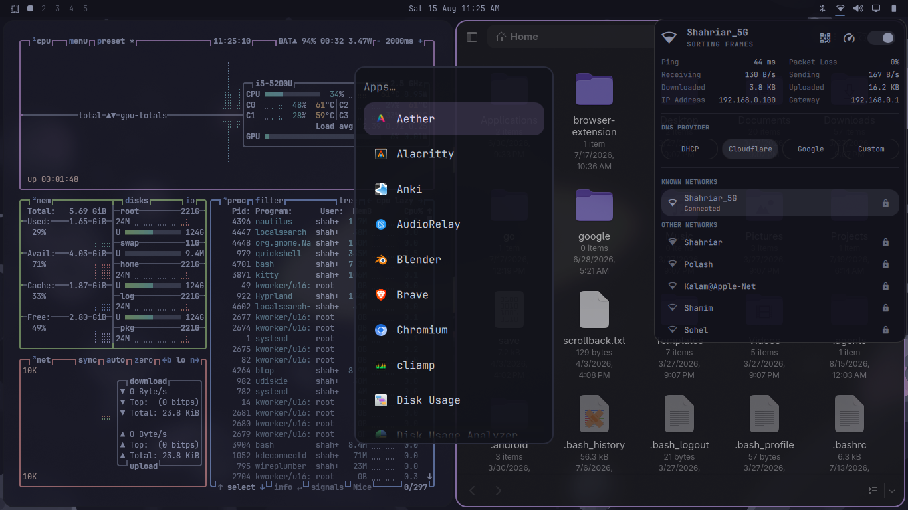

# ☕ Hittake Cappu Theme for Omarchy

A customized Catppuccin Mocha theme with translucent Quickshell styling, compact typography, rounded windows, and curated wallpapers.

## 🖥️ Preview


## 🎨 Theme Specs
- **Palette**: Catppuccin Mocha (Accent: `#89b4fa`, Background: `#1e1e2e`, Foreground: `#cdd6f4`, Mauve: `#cba6f7`)
- **Shell**: Translucent dark surfaces with compact typography (`base-size = 11`)
- **Hyprland**: Gaps in: 2, Gaps out: 2, Rounding: 8, Gaussian blur & active opacity 0.93-0.95
- **Bar Configuration**: Included in `shell.json` (bottom bar, custom indicators & widgets)

## 📦 Usage
To apply this theme in Omarchy:
```bash
omarchy theme set "hittake-cappu"
```
